<div align="center">

<br/>


<br/><br/>

### A research-grade AI system that conducts realistic interviews,<br/>evaluates candidates across 8 signal dimensions,<br/>and produces professional assessment reports.

<br/>

[](https://python.org)
[](https://fastapi.tiangolo.com)
[](https://nextjs.org)
[](https://ai.google.dev)
[](https://pytorch.org)
[](https://huggingface.co)
[](https://xgboost.readthedocs.io)
[](LICENSE)

<br/>

[**Features**](#-key-features) · [**Tech Stack**](#-tech-stack) · [**Architecture**](#-system-architecture) · [**Quick Start**](#-quick-start) · [**API**](#-api-reference) · [**ML Pipeline**](#-ml-pipeline) · [**Roadmap**](#-roadmap)

<br/>

</div>

---

## 🔬 What Makes This Different

Most interview simulators are glorified flashcard apps. This system creates a **multi-dimensional evaluation pipeline** modeled after how companies like Google, Meta, and Amazon actually assess candidates — combining LLM reasoning, transformer-based ML models, speech analysis, and code execution into a unified scoring framework.

<table>
<tr>
<td width="50%">

**🎯 8-Signal Evaluation**
| Signal | Method |
|--------|--------|
| Technical Correctness | LLM rubric scoring |
| Depth of Knowledge | Adaptive follow-up probing |
| Communication | DistilBERT multi-head classifier |
| Problem Solving | Reasoning chain analysis |
| Speech & Confidence | Whisper ASR + prosodic features |
| Code Quality | Sandboxed exec + AST + CodeBERT |
| Behavioral (STAR) | DeBERTa 4-head detector |
| Final Verdict | XGBoost meta-model ensemble |

</td>
<td width="50%">

**📊 Interview Modes**
| Mode | Coverage |
|------|----------|
| `mixed` | Rotates all categories adaptively |
| `technical` | DS&A, system concepts, ML theory |
| `coding` | Live coding with test cases |
| `behavioral` | STAR method across 8 competencies |
| `system_design` | Architecture & scalability |

**📋 Output**
- Professional PDF reports with branded layout
- Hiring recommendation: `strong_hire` → `no_hire`
- Per-question breakdown with sub-dimension scores
- Personalized study recommendations

</td>
</tr>
</table>

---

## ✨ Key Features

<table>
<tr>
<td width="33%" valign="top">

### 🔄 Adaptive Interview Engine
- Difficulty auto-adjusts in real-time
- Follow-up probing on mediocre answers
- Progressive 3-level hint system
- Topic rotation across 5 categories
- 70+ seed questions with LLM expansion

</td>
<td width="33%" valign="top">

### 🎙️ Speech Intelligence
- **Whisper ASR** transcription
- Words-per-minute & pause analysis
- Filler word detection (um, uh, like...)
- Prosodic features via librosa
- Composite confidence scoring

</td>
<td width="33%" valign="top">

### 🖥️ Coding Evaluator
- **Monaco Editor** with syntax highlighting
- Sandboxed Python/JS execution
- AST-based complexity analysis
- Test case runner with diff output
- LLM code review (quality/efficiency/style)

</td>
</tr>
<tr>
<td width="33%" valign="top">

### 🎯 Behavioral Analyzer
- 60+ keyword STAR indicators
- 12-question bank, 8 competencies
- Per-component scoring (S/T/A/R)
- Red flag detection (vague, blaming)
- Competency-mapped follow-ups

</td>
<td width="33%" valign="top">

### 🧠 ML Model Pipeline
- **DeBERTa-v3** → answer quality (0-10)
- **DistilBERT** → communication (3-head)
- **CodeBERT** → code quality (3-head)
- **XGBoost** → 16-feature meta-scorer
- Jupyter notebooks with visualizations

</td>
<td width="33%" valign="top">

### 📄 Reports & Analytics
- **PDF export** with ReportLab
- Score bars, recommendation badge
- Strengths/weaknesses two-column layout
- Per-question breakdown table
- Dashboard with aggregate analytics

</td>
</tr>
</table>

---

## 🛠 Tech Stack

<table>
<tr>
<td align="center" width="14%"><b>Backend</b></td>
<td align="center" width="14%"><b>Frontend</b></td>
<td align="center" width="14%"><b>AI / LLM</b></td>
<td align="center" width="14%"><b>ML Models</b></td>
<td align="center" width="14%"><b>Speech</b></td>
<td align="center" width="14%"><b>Data</b></td>
<td align="center" width="14%"><b>Reports</b></td>
</tr>
<tr>
<td align="center">FastAPI<br/>Pydantic<br/>Uvicorn</td>
<td align="center">Next.js 16<br/>React 19<br/>Tailwind</td>
<td align="center">Groq 2.0<br/>Prompt Eng.<br/>JSON Mode</td>
<td align="center">PyTorch<br/>Transformers<br/>XGBoost</td>
<td align="center">Whisper<br/>librosa<br/>soundfile</td>
<td align="center">SQLAlchemy<br/>SQLite<br/>Pydantic</td>
<td align="center">ReportLab<br/>Jinja2<br/>PDF Gen</td>
</tr>
</table>

---

## 🏗️ System Architecture

```
┌─────────────────────────────────────────────────────────────────────────────┐
│                          FRONTEND  (Next.js 16)                             │
│  Landing ── Interview Setup ── Live Session ── Report ── Coding ── STAR    │
│                              │ Behavioral │ Dashboard                       │
└──────────────────────────────┬──────────────────────────────────────────────┘
                               │  REST API (Axios → JSON)
┌──────────────────────────────▼──────────────────────────────────────────────┐
│                          BACKEND  (FastAPI)                                  │
│                                                                             │
│  ┌──────────┐  ┌──────────┐  ┌──────────┐  ┌──────────┐  ┌──────────┐     │
│  │Interview │  │ Speech   │  │ Coding   │  │Behavioral│  │   ML     │     │
│  │ Router   │  │ Router   │  │ Router   │  │ Router   │  │ Router   │     │
│  └────┬─────┘  └────┬─────┘  └────┬─────┘  └────┬─────┘  └────┬─────┘     │
│       │              │             │              │             │           │
│  ┌────▼──────────────▼─────────────▼──────────────▼─────────────▼────────┐  │
│  │                        SERVICE LAYER                                  │  │
│  │  Interview Agent │ Speech Processor │ Code Evaluator │ STAR Analyzer  │  │
│  │  LLM Client │ PDF Generator │ ML Inference Service                    │  │
│  └────────────────────────────────┬──────────────────────────────────────┘  │
└───────────────────────────────────┬─────────────────────────────────────────┘
               ┌────────────────────┼────────────────────┐
       ┌───────▼────────┐  ┌───────▼────────┐  ┌────────▼───────┐
       │  SQLite / PG   │  │ Groq API  │  │  ML Models     │
       │  (SQLAlchemy)  │  │  (LLM API)    │  │  (PyTorch)     │
       └────────────────┘  └────────────────┘  └────────────────┘
```

---

## 🚀 Quick Start

<details>
<summary><b>Prerequisites</b></summary>

- Python 3.11+
- Node.js 18+
- [Groq API API key](https://aistudio.google.com/apikey) (free tier works)

</details>

### 1️⃣ Backend

```bash
git clone https://github.com/md-hameem/Advanced-AI-Interview-Simulator--Research-Level-Project-.git
cd Advanced-AI-Interview-Simulator--Research-Level-Project-

cd backend
python -m venv venv && venv\Scripts\activate   # Windows
# source venv/bin/activate                     # macOS / Linux
pip install -r requirements.txt

cp .env.example .env
# ✏️  Set GEMINI_API_KEY=your_key_here

uvicorn main:app --reload
```

> 📖 Swagger docs → **http://localhost:8000/docs**

### 2️⃣ Frontend

```bash
cd frontend
npm install && npm run dev
```

> 🌐 App → **http://localhost:3000**

### 3️⃣ ML Pipeline (Optional)

```bash
# Generate datasets + train all models
python -m ml.train --all --generate-data --epochs 5

# Or run interactively via Jupyter
jupyter notebook ml/01_dataset_exploration.ipynb
```

---

## 📡 API Reference

<details>
<summary><b>Core Interview</b> — 8 endpoints</summary>

| Method | Endpoint | Description |
|--------|----------|-------------|
| `POST` | `/api/candidates` | Register candidate |
| `GET` | `/api/candidates` | List candidates |
| `POST` | `/api/interviews` | Create session |
| `POST` | `/api/interviews/{id}/start` | Start → first question |
| `POST` | `/api/interviews/{id}/questions/{qid}/answer` | Submit answer → eval |
| `POST` | `/api/interviews/{id}/hint` | Get progressive hint |
| `GET` | `/api/interviews/{id}/report` | Assessment report (JSON) |
| `GET` | `/api/interviews/{id}/report/pdf` | Download report (PDF) |

</details>

<details>
<summary><b>Speech</b> — 2 endpoints</summary>

| Method | Endpoint | Description |
|--------|----------|-------------|
| `POST` | `/api/speech/transcribe` | Whisper speech-to-text |
| `POST` | `/api/speech/analyze` | Full speech metrics |

</details>

<details>
<summary><b>Coding</b> — 4 endpoints</summary>

| Method | Endpoint | Description |
|--------|----------|-------------|
| `GET` | `/api/coding/questions` | List coding problems |
| `GET` | `/api/coding/questions/{id}` | Get problem + starter code |
| `POST` | `/api/coding/execute` | Sandboxed code execution |
| `POST` | `/api/coding/evaluate/{id}` | Full evaluation pipeline |

</details>

<details>
<summary><b>Behavioral</b> — 4 endpoints</summary>

| Method | Endpoint | Description |
|--------|----------|-------------|
| `GET` | `/api/behavioral/competencies` | List competencies |
| `GET` | `/api/behavioral/questions` | List/filter questions |
| `POST` | `/api/behavioral/detect-star` | Quick STAR detection |
| `POST` | `/api/behavioral/analyze/{id}` | Full STAR + competency analysis |

</details>

<details>
<summary><b>ML Predictions</b> — 5 endpoints</summary>

| Method | Endpoint | Description |
|--------|----------|-------------|
| `GET` | `/api/ml/status` | Model availability |
| `POST` | `/api/ml/predict/answer-quality` | DeBERTa answer scoring |
| `POST` | `/api/ml/predict/communication` | Clarity / fluency / structure |
| `POST` | `/api/ml/predict/star` | S / T / A / R detection |
| `POST` | `/api/ml/predict/code-quality` | Quality / efficiency / style |

</details>

<details>
<summary><b>Analytics</b> — 1 endpoint</summary>

| Method | Endpoint | Description |
|--------|----------|-------------|
| `GET` | `/api/analytics/overview` | Dashboard aggregate stats |

</details>

> Full interactive docs at `/docs` (Swagger UI) or `/redoc` (ReDoc)

---

## 🧠 ML Pipeline

Five specialized transformer + ensemble models trained via professional Jupyter notebooks with synthetic data generation, advanced training techniques, and publication-quality visualizations.

| Model | Architecture | Input | Output | Params |
|-------|-------------|-------|--------|--------|
| **Answer Quality** | `deberta-v3-small` | Question + Answer | Score 0-10 | 44M |
| **Communication** | `distilbert-base` | Answer text | Clarity / Fluency / Structure (0-5) | 66M |
| **STAR Analyzer** | `deberta-v3-small` | Behavioral answer | S / T / A / R scores (0-5) | 44M |
| **Code Evaluator** | `microsoft/codebert` | Source code | Quality / Efficiency / Style (0-5) | 125M |
| **Meta Scorer** | `XGBoost` (200 trees) | 16-feature vector | Final score 0-10 | — |

**Colab T4 GPU Training Specs:** 26,000+ synthetic samples · 10 epochs · 256 max sequence length · Warmup + cosine LR scheduling · Early stopping with checkpointing · 14+ auto-saved figures

```
ml/
├── 01_dataset_exploration.ipynb   # Generate data + 7 professional visualizations
├── 02_model_training.ipynb        # Local modular pipeline (CPU/MPS)
├── colab_training.ipynb           # Self-contained all-in-one notebook for T4 GPU
├── config.py                      # Hyperparameters for all models
├── dataset.py                     # Synthetic data generators (26,000+ samples)
├── train.py                       # CLI: python -m ml.train --all
├── inference.py                   # Production inference service
└── models/                        # 5 model architectures
data/
├── ml_training/                   # Generated JSON datasets
└── figures/                       # Auto-saved visualization PNGs
```

<details>
<summary><b>📸 Dataset Visualizations</b> — click to expand</summary>

<br/>

**Dataset Overview — All 5 Target Score Distributions**

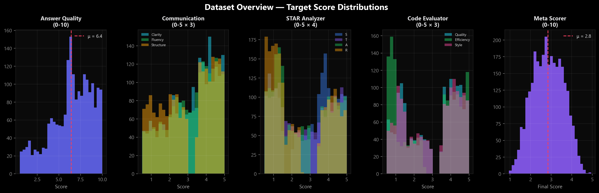

---

**Answer Quality — Score Distribution, Quality Tiers, Score vs Length, Per-Question Analysis**

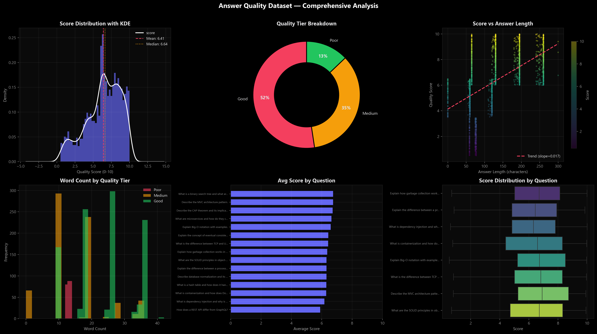

---

**Communication Clarity — Clarity/Fluency/Structure KDE, Correlation Heatmap, Violin Plots**

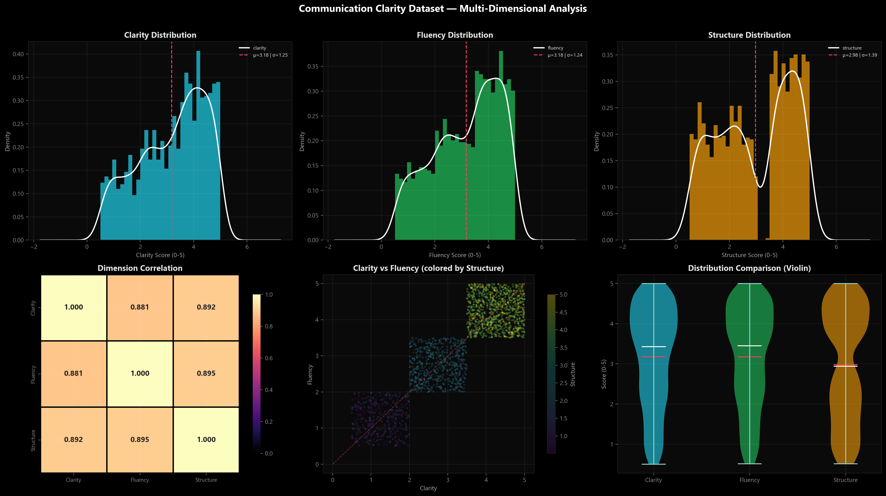

---

**STAR Behavioral Analyzer — Component Distributions, Radar Profile, Correlation Matrix**

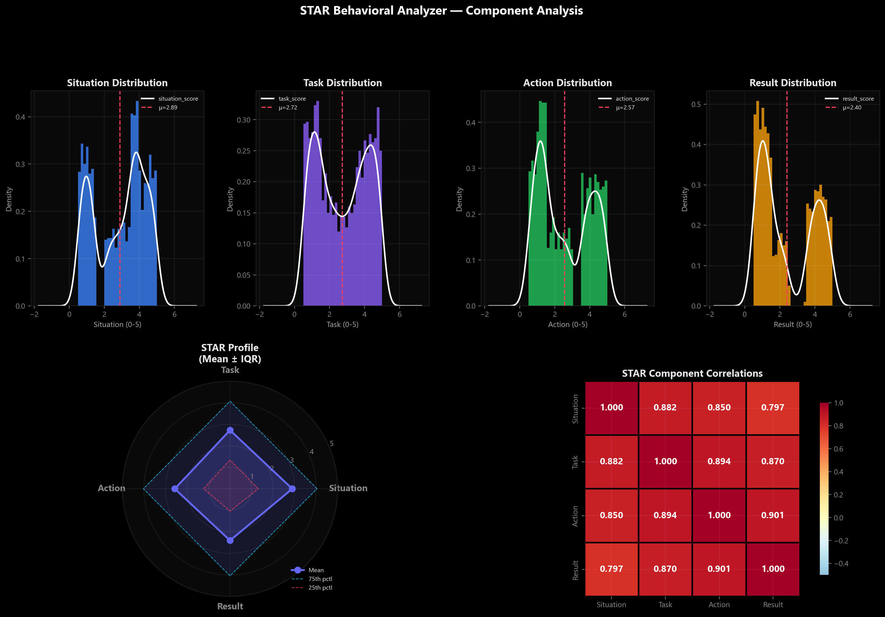

---

**Code Evaluator — Quality/Efficiency/Style Distributions, Length Analysis, Correlations**

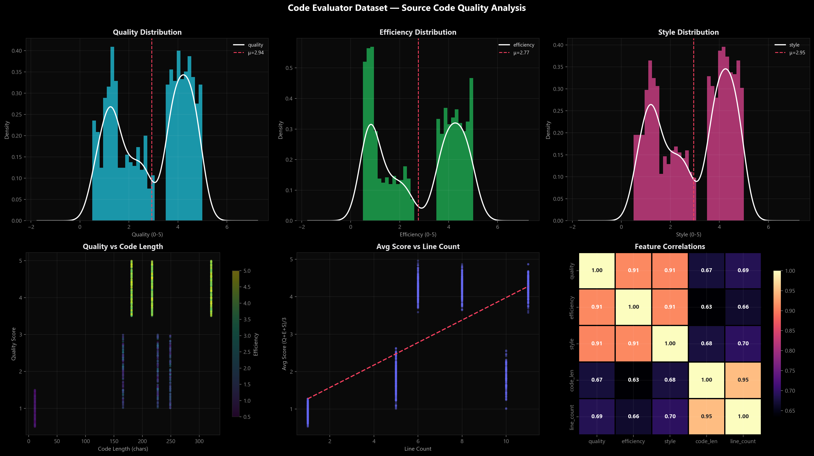

---

**Meta Scorer — Final Score Distribution, Feature Correlations, 17×17 Heatmap**

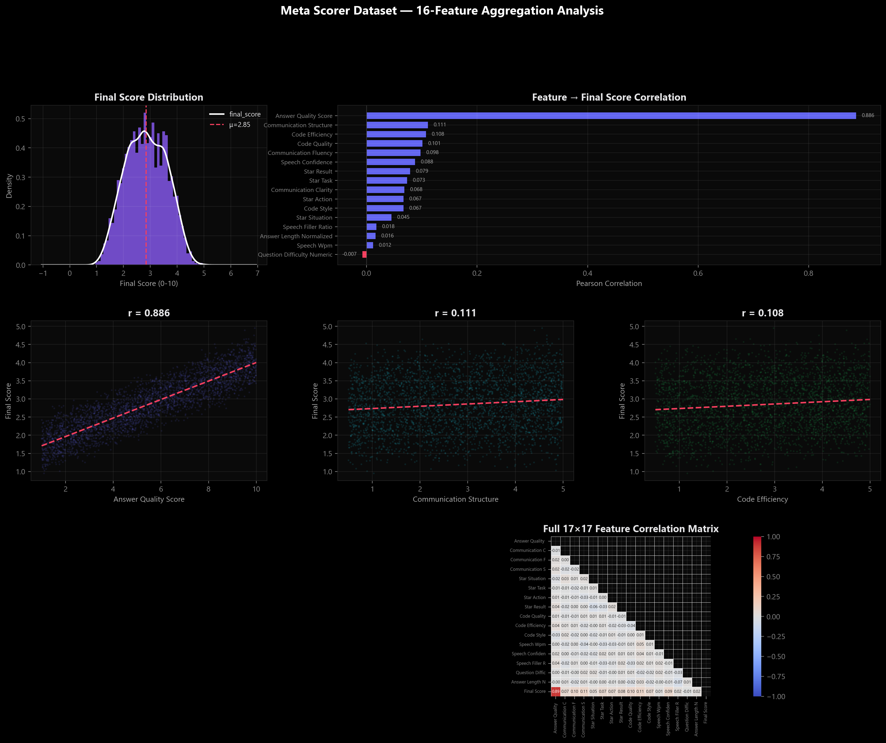

---

**Cross-Dataset Comparison — All Target Dimensions Normalized (Violin)**

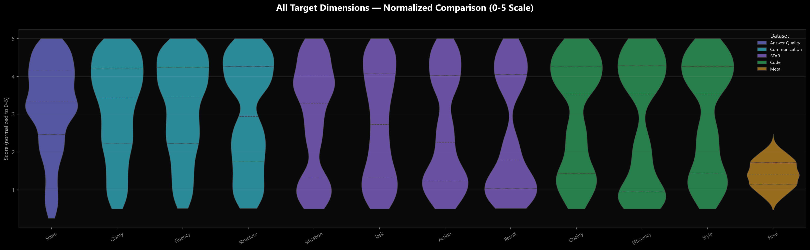

</details>

<details>
<summary><b>📈 ML Training Performance & Analysis</b> — click to expand</summary>

<br/>

**Model 1: Answer Quality (DeBERTa-v3-small)**
*Training loss vs Validation loss with Cosine LR schedule. Pred vs True scatter shows regression line and Spearman correlation for the 0-10 score output.*
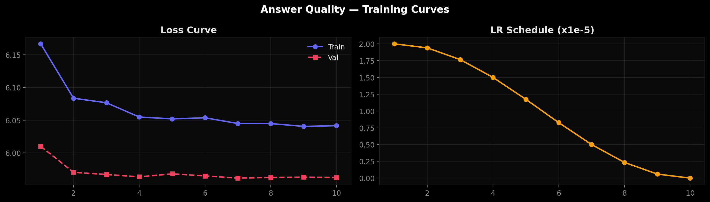
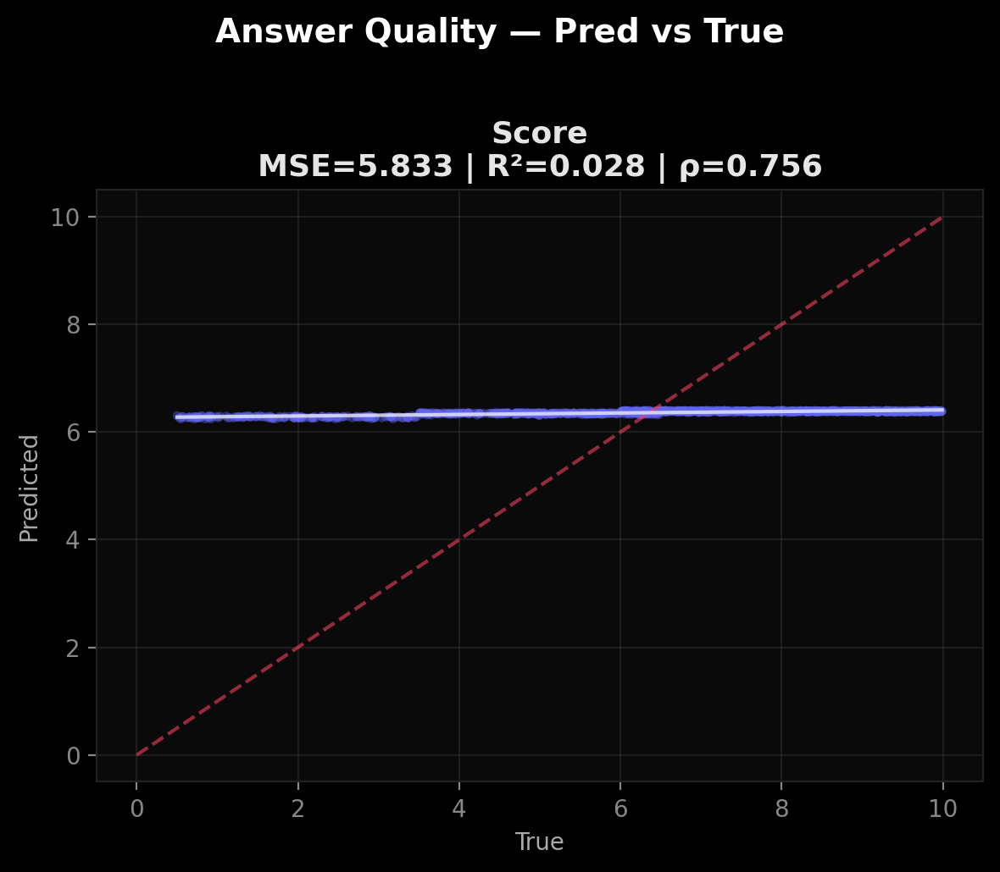

---

**Model 2: Communication Clarity (DistilBERT)**
*Multi-head prediction (Clarity, Fluency, Structure). Evaluation charts display individual MSE, R², and Spearman ρ bounds for each dimension.*
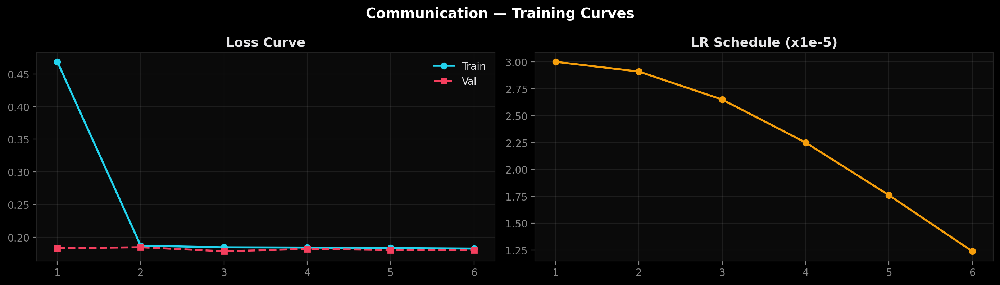
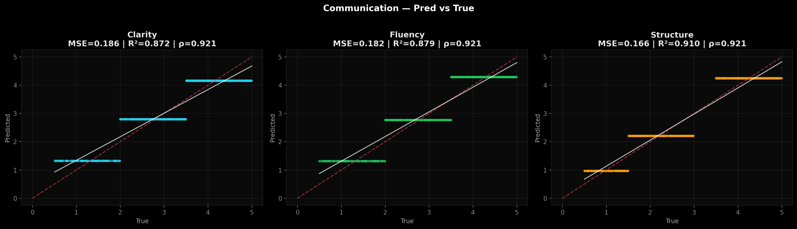

---

**Model 3: STAR Behavioral Analyzer (DeBERTa-v3-small)**
*4-head behavioral dimension outputs (Situation, Task, Action, Result). 10 epochs on Colab T4 GPU.*
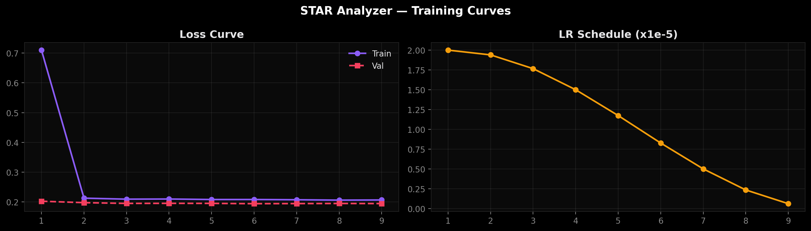
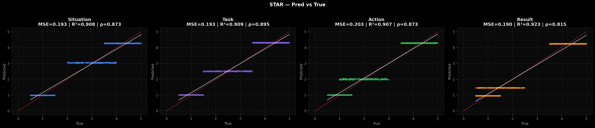

---

**Model 4: Code Evaluator (CodeBERT)**
*Source code analysis mapped to 3 continuous dimensions (Quality, Efficiency, Style). Scatter plots indicate strong linear correlation between predictions and ground truth labels.*
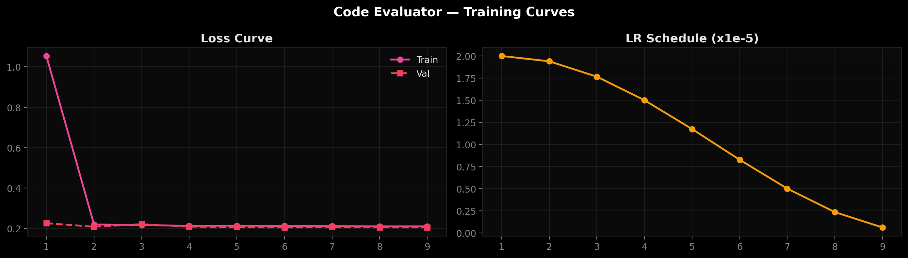
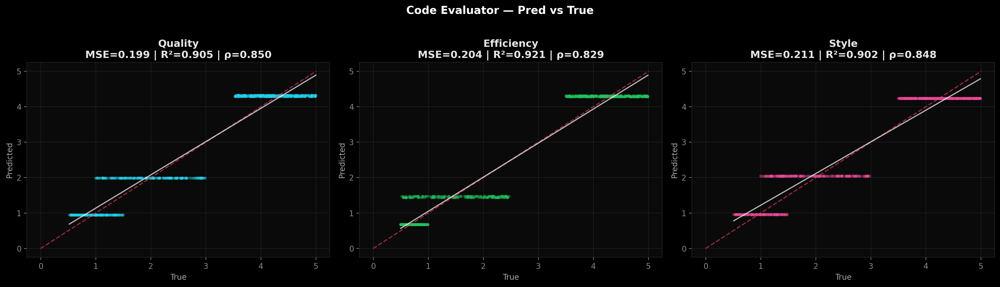

---

**Model 5: Meta Scorer (XGBoost Ensemble)**
*16-feature vector mapping to the Final Evaluation Score. Feature Importance chart highlights the most critical factors influencing the overall rating.*
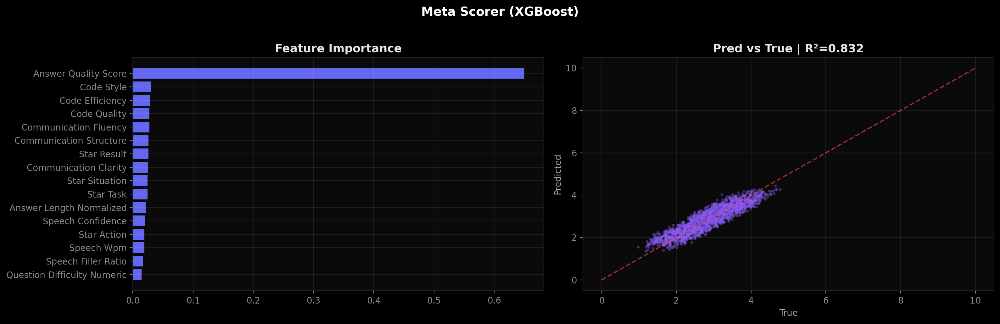

</details>

> 📊 See [`ml/README.md`](ml/README.md) for dataset schemas, download links, and configuration details.

---

## 📁 Project Structure

```
.
├── backend/
│   ├── main.py                        # FastAPI app + router registration
│   ├── config.py                      # Settings (Pydantic)
│   ├── database.py                    # SQLAlchemy engine
│   ├── schemas.py                     # Request/response models
│   ├── models/interview.py            # Candidate, Interview, Question
│   ├── routers/
│   │   ├── interview.py               # Core flow + PDF download
│   │   ├── speech.py                  # Transcription + analysis
│   │   ├── coding.py                  # Code execution + evaluation
│   │   ├── behavioral.py              # STAR analysis
│   │   └── ml.py                      # Model predictions
│   └── services/
│       ├── llm_client.py              # Groq prompts
│       ├── interview_agent.py         # Adaptive logic
│       ├── speech_processor.py        # Whisper + librosa
│       ├── code_evaluator.py          # Sandbox + AST
│       ├── behavioral_analyzer.py     # STAR detection
│       └── pdf_generator.py           # ReportLab
├── frontend/src/
│   ├── app/                           # Next.js pages (8 routes)
│   ├── hooks/useAudioRecorder.ts      # Mic recording hook
│   └── lib/api.ts                     # Typed API client
├── ml/                                # Training pipeline (see above)
├── data/                              # Seed questions + ML datasets
├── CHANGELOG.md
├── CONTRIBUTING.md
└── LICENSE
```

---

## 🗺️ Roadmap

| Status | Feature | Description |
|--------|---------|-------------|
| ✅ | **Core Interview Engine** | Adaptive questioning, follow-ups, hints, rubric scoring |
| ✅ | **Speech Intelligence** | Whisper ASR, WPM, fillers, confidence analysis |
| ✅ | **Coding Evaluator** | Monaco editor, sandbox execution, complexity analysis |
| ✅ | **Behavioral Analyzer** | STAR detection with 60+ indicators, 8 competencies |
| ✅ | **PDF Report Export** | Professional branded reports with ReportLab |
| ✅ | **ML Pipeline** | DeBERTa, DistilBERT, CodeBERT, XGBoost + notebooks |
| ✅ | **Emotion Detection** | Facial + voice tone analysis (OpenCV, DeepFace) |
| ✅ | **Interviewer Personalities** | Google / Amazon / Startup styles |
| ✅ | **Multi-Agent System** | Tech Lead, HR, and Coordinator evaluator agents |
| ✅ | **Personalized Learning** | Adaptive study plan based on weakness patterns |
| ✅ | **Frontend 3D Modernization** | React Three Fiber landing page + Framer Motion animations |
| ✅ | **Cinematic Scrollytelling** | Scroll-driven kinetic typography, Bento layouts, mesh gradients |
| ✅ | **Advanced ML Training** | Professional notebooks with LR scheduling, early stopping, 21+ visualizations |

---

## 🤝 Contributing

Contributions are welcome! Please read the [Contributing Guide](CONTRIBUTING.md) for setup instructions, coding standards, and PR workflow.

## 📄 License

MIT License — see [LICENSE](LICENSE) for details.

---

<div align="center">

<br/>

**Built with**

[](https://fastapi.tiangolo.com)
[](https://nextjs.org)
[](https://ai.google.dev)
[](https://pytorch.org)
[](https://huggingface.co)

<sub>⭐ Star this repo if you find it useful!</sub>

<br/>

</div>
